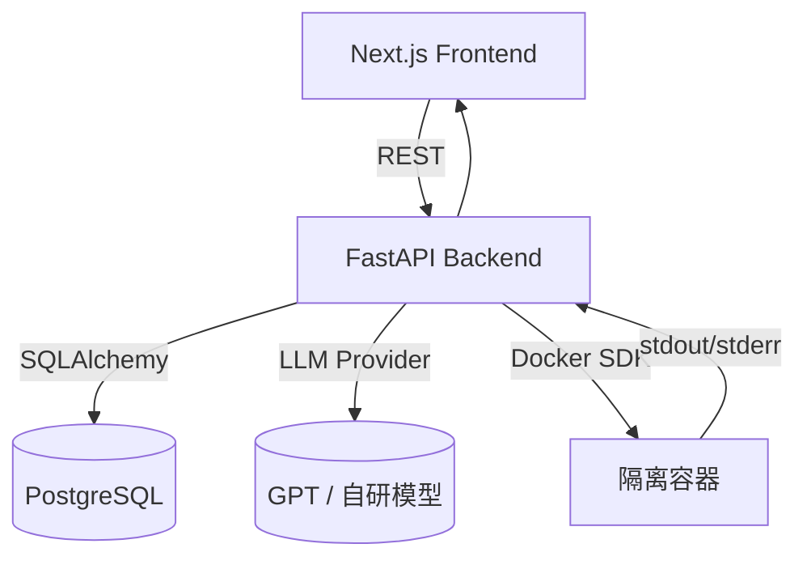

# 系统架构与流程总览

## 1. 产品结构
- **Web 前端（Next.js / V0.dev 生成）**
  - 负责题目录入、闪卡与思维导图展示、代码练习界面。
  - 与后端 API 交互获取或更新知识内容。
- **后端服务（FastAPI）**
  - 提供 REST API：题目、知识项、练习题、代码执行。
  - 内部模块：LLM 生成服务、知识库管理、沙箱执行、判题器。
- **数据存储**
  - PostgreSQL：结构化数据（questions、knowledge_items、problems 等）。
  - （可选）Redis：缓存、任务队列、速率限制（规划阶段）。
- **LLM Provider**
  - 默认 mock，支持接入 OpenAI/自研模型。
  - 通过统一接口 `generate_from_question` 生成结构化 JSON。
- **代码沙箱**
  - Docker SDK 创建隔离容器，执行用户代码。
  - 目前支持 Python、C++；可扩展其他语言。

## 2. 核心业务流程
### 2.1 题目驱动生成（PRD1）
1. 用户在前端提交题目。
2. 后端 `POST /questions` 创建记录。
3. `POST /generate` 调用 LLM Provider 生成闪卡、思维导图、代码、项目应用并存入 `knowledge_items`。
4. 前端渲染结果，支持用户编辑（`PUT /items/{id}`）并持久化。
5. 列表页通过 `GET /items` 支持关键词、标签、难度筛选；可导出 Markdown/JSON。

### 2.2 交互式代码练习（PRD2）
1. 前端三栏布局：题目描述、代码编辑器、输出面板。
2. `GET /problems/{id}` 提供题目、参考答案、测试用例。
3. 用户在“我的代码”页签提交运行请求 → `POST /execute`。
4. 后端沙箱编译/运行代码，收集 stdout/stderr/耗时。
5. 判题器按测试用例比较输出（exact/tolerant），返回每个 case 结果及总通过情况。

## 3. 部署形态
| 环境 | 说明 | 推荐配置 |
|------|------|---------|
| 本地开发 | Docker Compose，挂载源码热更新 | `docker compose up`; `alembic upgrade head` |
| 测试/预发 | CI 构建镜像，部署至测试集群（K8s/Swarm） | 外部 Postgres/Redis；Mock LLM 或受限 key |
| 生产 | 托管于 K8s/容器服务，接入真实 LLM | 监控（Prometheus/Grafana）、日志集中化（ELK），WAF 与身份鉴权 |

## 4. 扩展路线
- **LLM Provider**：配置化选择；引入重试、缓存、内容审计。
- **知识库功能**：
  - 标签体系、难度评估、间隔重复算法（SM-2）。
  - 导出多格式（PDF、Anki）。
- **练习模块**：
  - 支持更多语言（Java、Go）。
  - 更细粒度的判题模式（忽略空格、误差范围、JSON 比较）。
  - 添加运行指标（内存峰值、退出码）。
- **安全合规**：
  - 沙箱最小权限：非 root、只读 rootfs、cgroup 资源限制、syscall 白名单。
  - API 鉴权：JWT/Bearer、速率限制、审计日志。
- **团队协作**：
  - 多用户/团队空间，权限管理。
  - 模板化题目导入与批量审核流程。

## 5. 依赖与基础设施
- **外部依赖**：
  - Docker Daemon（沙箱执行）
  - 可选：LLM API Key
- **内部工具链**：
  - Alembic：数据库迁移
  - GitHub Issues：任务拆分与追踪（#1 ~ #10 已创建）
  - 未来可接入 CI（GitHub Actions）运行测试与 lint

## 6. 风险与对策
- **LLM 输出不符合结构** → Pydantic 校验 + 重试/降级策略。
- **沙箱安全** → 禁网、资源限制、临时文件系统；后续引入 gVisor/Firecracker。
- **性能瓶颈** → 缓存生成结果、分布式队列处理批量任务、监控 QPS。
- **数据一致性** → 事务管理，幂等设计（重复生成覆盖/追加策略）。
- **成本控制** → 统计 LLM 调用次数、缓存热门题目、前端提示用量。

