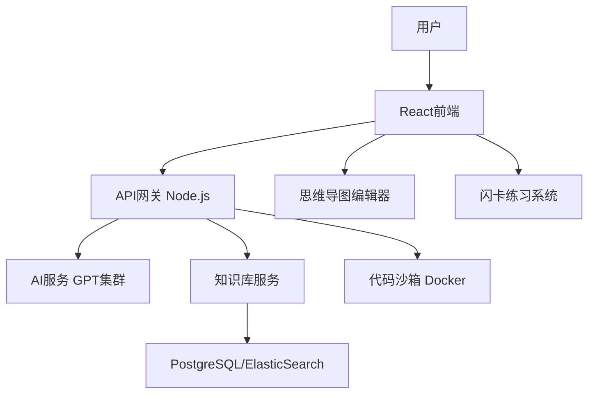

✅ 明白啦！核心需求在于：**用户上传题目 → 系统自动生成卡片（闪卡）、思维导图、解析/代码 → 用户可在线修改和管理**。也就是说，网站的灵魂是一个 **“题目驱动的自动知识生成与可编辑平台”**。下面我为你生成一个更**详细的PRD文档**，专门围绕你强调的核心需求。

---

# **PRD 文档 v2.0 - 面试题库智能化学习平台**  

### 1. 产品定位
**产品愿景**：帮助程序员通过“在线导入面试题 → 自动生成知识结构化内容 → 在线修改、记忆与实战”，实现系统化面试准备和高效的学习路径。  

**一句话目标**：  
> 上传一道题，就能立刻生成**闪卡 + 思维导图 + 代码解析**，并且支持在线修改与扩展。  

---

### 2. 用户核心场景
1. 我在准备C++面试，我上传一题：  
👉「C++ 的虚函数有什么作用？」  
- 系统立即生成：  
  - **闪卡**（问题+简答版解释+潜在陷阱）  
  - **思维导图**（虚函数定义 → 使用场景 → 内存结构 → 优缺点）  
  - **代码片段**（基类/派生类例子）  
  - **项目应用解析**（在大型系统中如何用虚函数实现模块扩展）  
- 我还能点击**编辑按钮**，修改AI答案，增删节点，保存到我的知识库。  

2. 我复习时：  
- 打开某一知识主题 → 出现闪卡问答 + 思维导图回顾  
- 隐藏答案自己尝试回答，再点开“显示答案”对照  
- 执行相关代码片段，验证效果  

---

### 3. 功能需求

#### **3.1 核心功能：题目驱动的知识生成**
| 功能 | 需求细节 | 技术实现 | 备注 |
|------|-----------|----------|------|
| 导入题目 | - 用户粘贴文本或上传批量题目文件（txt/md/json）<br>- 支持一题一题输入或批量导入 | 前端表单上传 + 文件解析（Node.js/Python） | 支持中文/英文 |
| 自动生成 | - 后端通过 LLM（GPT-4 / 自建大模型）生成：<br>① 闪卡 (问题+答案+陷阱)<br>② 思维导图（Mermaid/JSON图结构）<br>③ 示例代码+注释 <br>④ 项目应用场景解析 | Prompt工程: 题目 → 模板化提示词 → LLM输出<br>解析器：将结果转为统一结构化格式(JSON) | 必须保证结构化可修改 |
| 编辑与修订 | 用户可以在前端编辑：<br>① 修改答案文字 (Markdown编辑器)<br>② 修改思维导图结构 (节点增删拖拽)<br>③ 添加/修改代码片段 | 前端：React + Slate.js MD编辑器<br> 思维导图：使用React-Flow 或 MindElixir<br> 后端：保存结构化数据(JSON schema) | 必须自动保存到用户知识库 |
| 知识库管理 | 按“标签/难度/主题”进行分类储存，支持搜索、复习、导出 | 数据库：PostgreSQL<br>全文搜索：Elasticsearch | 推荐支持导出为PDF/Markdown |

---

#### **3.2 学习与练习功能**
- **闪卡记忆系统**
  - 间隔重复算法 (SM2 或 Anki算法)
  - 支持日常复习提醒
- **OJ判题系统**
  - 用户尝试写代码验证
  - 输出与标准答案对比（文本/单元测试）
  - “隐藏答案模式”：初次显示，复习时隐藏
- **交互式学习**
  - 点击思维导图节点 → 展开知识点详细说明 + 代码
  - 代码可直接在沙箱里运行

---

#### **3.3 项目应用场景**
- 用户上传项目代码 → 系统用 Tree-sitter 解析项目结构 → AI生成“本项目中相关知识点的作用”解释  
- 举例：用户有HTTP服务器 → 自动解析 "虚函数如何在请求路由中被用到"

---

### 4. 技术架构



---

### 5. 数据结构 (JSON Schema)

```json
{
  "question_id": "uuid",
  "question": "C++ 虚函数有什么作用？",
  "flashcard": {
    "answer": "虚函数用于实现多态...",
    "pitfalls": ["内存开销增加", "构造函数不能是虚函数"]
  },
  "mindmap": {
    "root": "虚函数",
    "children": [
      {"text": "定义", "children": []},
      {"text": "使用场景", "children": ["多态", "接口抽象"]},
      {"text": "内存机制", "children": ["虚表", "指针开销"]}
    ]
  },
  "code": {
    "lang": "cpp",
    "snippet": "class Base {...}; class Derived: public Base {...};",
    "explanation": "通过虚函数实现动态绑定"
  },
  "project_usage": "在HTTP服务器的请求分发中，虚函数可以..."
}
```

---

### 6. 阶段计划
| 阶段 | 时间 | 功能目标 | 可交付物 |
|------|------|----------|---------|
| **MVP** | 1-2个月 | - 单题输入+自动生成闪卡/思维导图/解析 <br>- 支持手动编辑 <br>- 保存至知识库 | 基础web应用 |
| **迭代1** | 3-4个月 | - 批量题库导入 <br>- 闪卡复习系统 (间隔重复) <br>- 思维导图编辑支持 | 稳定版本 |
| **迭代2** | 5-6个月 | - 代码沙箱验证 <br>- 隐藏答案模式 <br>- 判题系统 | 核心产品雏形 |
| **迭代3** | 7-8个月 | - 项目源码解析 <br>- 企业版API对接 | 完整产品 |

---

### 7. 注意事项
- **LLM生成结构必须规范**：输出标准化 JSON，避免渲染错误  
- **可编辑性要求高**：任何AI生成的结果必须允许“即时修改”  
- **性能要求**：  
  - 导入题目 → 生成结果 ≤ 3s  
  - 思维导图渲染 ≤ 500ms  
- **安全性**：沙箱需限制资源，避免恶意代码执行  
- **用户体验**：自动保存、可导出、支持移动端浏览  

---

### 8. Codex提示词设计（必要内容）
当用户上传题目时，传给 Codex/LLM 的 prompt 模板示例：  
```
请基于以下题目，生成结构化JSON，格式必须满足：
- question: 题目原文
- flashcard: 简要答案 + 陷阱列表
- mindmap: 层级结构树（用JSON表示）
- code: 语言, 示例代码, 注释解释
- project_usage: 在实际项目中的应用
题目： {用户提供的问题}
```

---

🚀 **总结**  
这个PRD更精确地围绕你的核心亮点：  
✅ **题目输入 → 自动生成知识卡片+思维导图+解析**  
✅ **一切都支持修改与保存**  
✅ **逐步扩展到判题与项目解析**

这样Codex开发团队就能准确知道如何落地实现你想要的效果。  

要不要我帮你把 JSON Schema 和前端编辑页面的交互流程（例如“导入题目 → AI生成 → 前端渲染 → 可编辑 → 保存至DB”）再详细画一个流程图？这样Codex拿到后就是即插即用的实现蓝图了。
